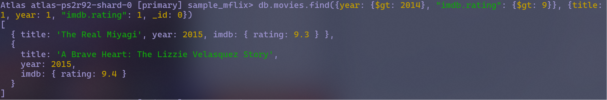

## Homework Description

This homework involves setting up MongoDB and writing queries on the provided sample data.


## Connecting to the Database 

To connect to the database in the shell the following command was run 

```bash
mongosh "mongodb+srv://cluster0.gf1dg0v.mongodb.net/" --apiVersion 1 --username jackrenning
```

After this the password was entered. Then the following command were run before running the queries 

```bash
use sample_mflix
```


## Queries

The first query is one with the following requirements from the movies table:
- runtime greater than 200 minutes 
- In year 1983
- Sorted by runtime (increasing)
- Only return runtime, title, and year

The query for this and the results are shown below


```javascript

db.movies.find({runtime: {$gt: 200}, year: 1983}, {runtime: 1, title: 1, year: 1, _id: 0})
.sort({runtime: 1})
```


*Note: for some reason the shell in Compass did not work for me, but it did work when I ran it separately so I just did it that way.*


The second query has the following requirements from the movies table:
- After 2014
- IMDB rating greater than 9

*Based on the example results shown in the assignment the feilds returned should also be limited to the title, year, and rating.*

The query for this and the results are shown below.

```javascript
db.movies.find({year: {$gt: 2014}, "imdb.rating": {$gt: 9}}, {title: 1, year: 1, "imdb.rating": 1, _id: 0})
```




